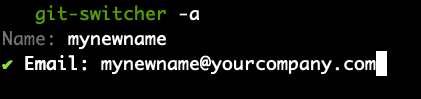

# Git user manager

Manager local git accounts(name / email), switch global or project scope git user.

## Feature
- automatically initialize the local file based database (from your local git / project git config file)
- interactive selection of users (from local database) and scope
- `-a` option to add new user info(name / email) to local sqlite database

## Usage

### install
prerequisites: [golang installed](Download and install)

`go get -u github.com/zhengzhou1992/git-switcher`

### switch user

run `git-switcher` command and select scope(global or single git repository) and user according to prompt.

### add new user
run `git-switcher -a` command, input your name and email.

### manage local users
you can use any sqlite client to connect to local user database(~/.git-switcher/user.db), and check / create / update / delete local users.